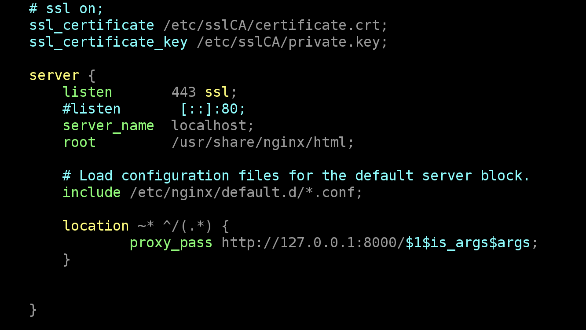

# EC2で無料https化をする手順

※無料で対応するための暫定手順。3ヶ月で証明書期限が切れてしまい、その度に手動で発効が必要なので、ある程度アクセスが来るようになったら今後はACMなどによって対応すること。

1. nginxをEC2にインストール
```
sudo amazon-linux-extras install nginx1 -y
sudo cp -a /etc/nginx/nginx.conf /etc/nginx/nginx.conf.back
sudo systemctl start nginx
sudo systemctl enable nginx
```
2. ZeroSSLで証明書発行

https://app.zerossl.com/dashboard

- ↑から無料プランで発行していく
- 検証手順は `HTTP File Upload` にする

- 検証用のtxtファイルを置くフォルダ作成
```
sudo mkdir /usr/share/nginx/html/.well-known/pki-validation/
```
- 上記フォルダ内に指定されたファイルを用意する
- ZeroSSLで検証をする
- 証明書一式zipをダウンロード、展開
- S3にアップロード
- 下記コマンドでEC2に配置
```
sudo mkdir /etc/sslCA
aws s3 cp s3://numbuyer-sources-a/certificate.crt /etc/sslCA
aws s3 cp s3://numbuyer-sources-a/private.key /etc/sslCA
aws s3 cp s3://numbuyer-sources-a/ca_bundle.crt /etc/sslCA
```

3. SSL証明書をnginxにセット

- 公式の手順:
https://help.zerossl.com/hc/en-us/articles/360058295894-Installing-SSL-Certificate-on-NGINX
- `ssl on;` はコメントアウトし、serverディレクティブ内の`listen 80;`を`listen 443 ssl;`に変更。

4. nginxをリバースプロキシとして設定
以下をsereverディレクティブに追記。
```
location ~* ^/(.*) {
proxy_pass http://127.0.0.1:8000/$1$is_args$args;
}
```

5. nginxを再起動
```
sudo nginx -s reload
```

最終的なnginx.confのserverディレクティブ周りは以下。
